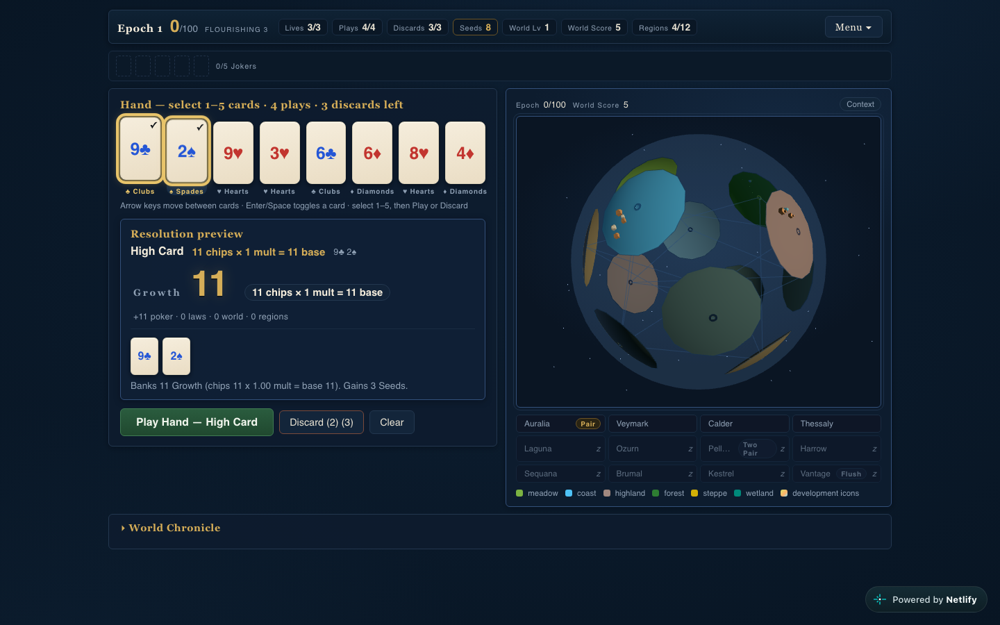

# Worldhand

A deterministic poker roguelike that builds a world, with a 3D globe, two modes
and a portable offline build.

**[Play Worldhand](https://worldhand.netlify.app/)** · [How to play Ascension](docs/ascension.md) · [Classic rules](docs/rules.md) · [Development evidence](docs/development/README.md)



The main menu offers two modes. Each keeps its own saves.

## Ascension — grow a world through six ages

A roguelike campaign of 25–40 minutes. Each age gives you a few poker **hands**
and **discards**. Only the cards that make a hand score, and each scoring card
grows its suit's world stat: ♥ Vitality, ♦ Prosperity, ♣ Industry,
♠ Knowledge. Peoples rise on the land that suits them, grow into kingdoms and
empires, and become allies or rivals of their neighbours. Every age ends in a
crisis you can see coming (a winter, a plague, an invasion, a market crash,
the machines, the Great Filter). Its forecast is exact, and it weighs the
world you built and the era's score against it. Endure it, or lose one of
three Resolve and carry its scar. Between ages, the Council sells world cards
and decrees and offers **legendaries** that bend the rules. Endure the final
crisis to ascend.

Hands are few, so you cannot fix every weakness. The game is in choosing which
ones you can survive. Finished runs unlock new cards, legendaries, peoples and
origins; each victory unlocks the next of eight **Omens**, stacking rules for a
harder climb. Everything autosaves, and runs can be exported to another device.

See **[How to play Ascension](docs/ascension.md)**.

## Classic — play hands, grow a world, keep it alive

Select one to five cards from an eight-card hand, preview their Growth, then commit
or discard. Each epoch gives you four plays and three discards to reach its target.
Beating the target advances immediately; missing it costs one of three lives.
There is no fixed final epoch: build for a higher World Score before the run ends.

Spend Seeds between epochs on Jokers, Planet cards, consumables, vouchers and
world upgrades. The twelve-region globe develops as you play. Specializations
contribute regional bonuses, while the shop provides most of the scaling decisions.
The current economy caps **per-play Seed income** and uses escalating geometric
targets; the detailed contracts and measured limitations live in the [rules](docs/rules.md).

## Run locally

Use Node.js 24 (pinned in `.nvmrc`, so `nvm use` picks it up):

```sh
git clone https://github.com/Figo5/worldhand.git
cd worldhand
npm ci
npm run dev             # http://localhost:5177
npm run build           # production site in dist/
npm run preview         # serve the production site
```

## Take it offline

```sh
npm run build:portable
```

Open **`dist-portable/worldhand.html`** directly in a modern browser. The single
HTML file bundles JavaScript, CSS and Three.js; it needs no server or network.
Export/import saves from the title screen to move a run between devices. Browser
storage behavior for `file://` varies, so keep an exported backup of a valued run.

## Architecture

- **Pure TypeScript engine:** seeded random state, poker evaluation and all state
  transitions live in `src/engine/`. The same seed and actions reproduce the run.
- **One scoring pipeline:** preview and commit share `buildPlan`, keeping the
  displayed result tied to the actual transaction.
- **React + Three.js:** React presents the hand, market and chronicle. The globe
  renders engine-owned region state; animation does not decide game outcomes.
  It loads as a separate chunk, so the title screen and hand do not wait for
  Three.js; the portable build inlines it.
- **Versioned local saves:** schema 4 / engine rules 8. Incompatible saves are
  preserved as legacy data and rejected with an explanation. Imports are validated
  before replacing an existing run.

## Testing

```sh
npm run typecheck      # app and tests
npm test
npm run build
npm run build:portable
# Optional browser checks of the file:// artifact:
npx playwright install chromium
node scripts/qa-portable.mjs
```

Verified on 2026-09-24 in GitHub Actions (Node.js 24): the type-check of app and
tests, **368 tests passed**, and production and portable builds without warnings.
Coverage includes poker, deterministic transitions, preview/commit, bounded economy,
save validation, death boundaries, the Ascension prototype, and 40 recorded Classic
replays that must reproduce exactly. GitHub Actions runs all of this and the browser
checks on every push (`.github/workflows/ci.yml`). The portable browser checks also
passed: offline loading, the inlined 3D globe, keyboard play, the chronicle menu, shop
purchases, a full run, reload persistence, mobile layout, and save export/import.

## Status and limitations

A playable single-player game with no backend, accounts or real-money betting.
Balance evidence comes from bounded scripted policies, not human win-rate studies.
Regional bonuses have a measured low impact on many choices; the rules document
preserves that limitation and the rejected experiments. Keyboard controls and
reduced-motion support are included.

## License

**Undecided.** `package.json` declares `"license": "MIT"`, but the repository has
no LICENSE file, and that field has not been confirmed as the project's license.
Worldhand may become a commercial game; whether it will be open source,
source-available, dual licensed, or proprietary with selected open-source
components has not been decided. Until a decision is recorded here, do not treat
the `package.json` field as a grant of rights.
